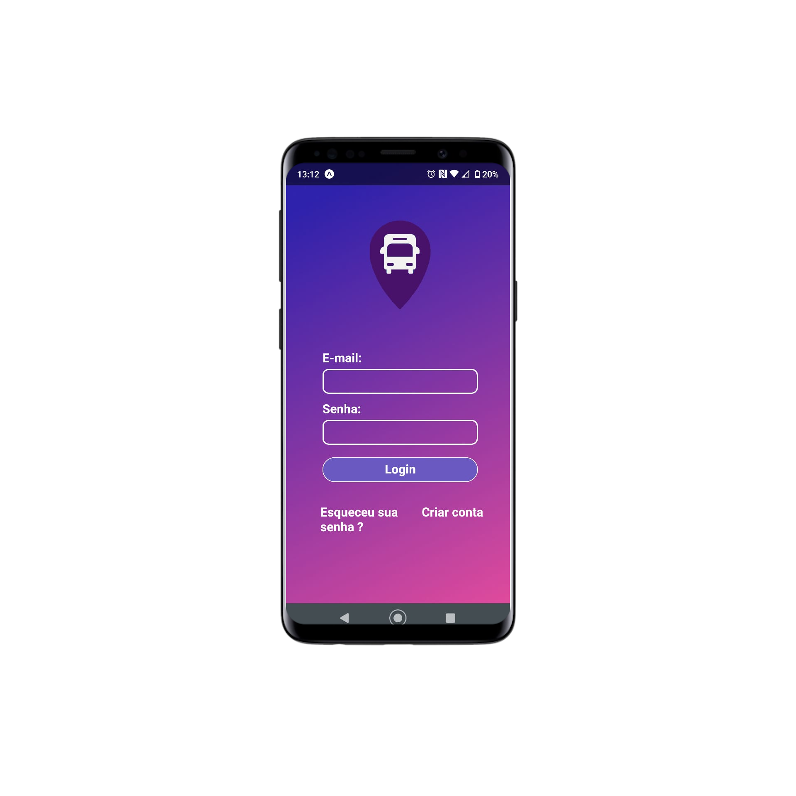
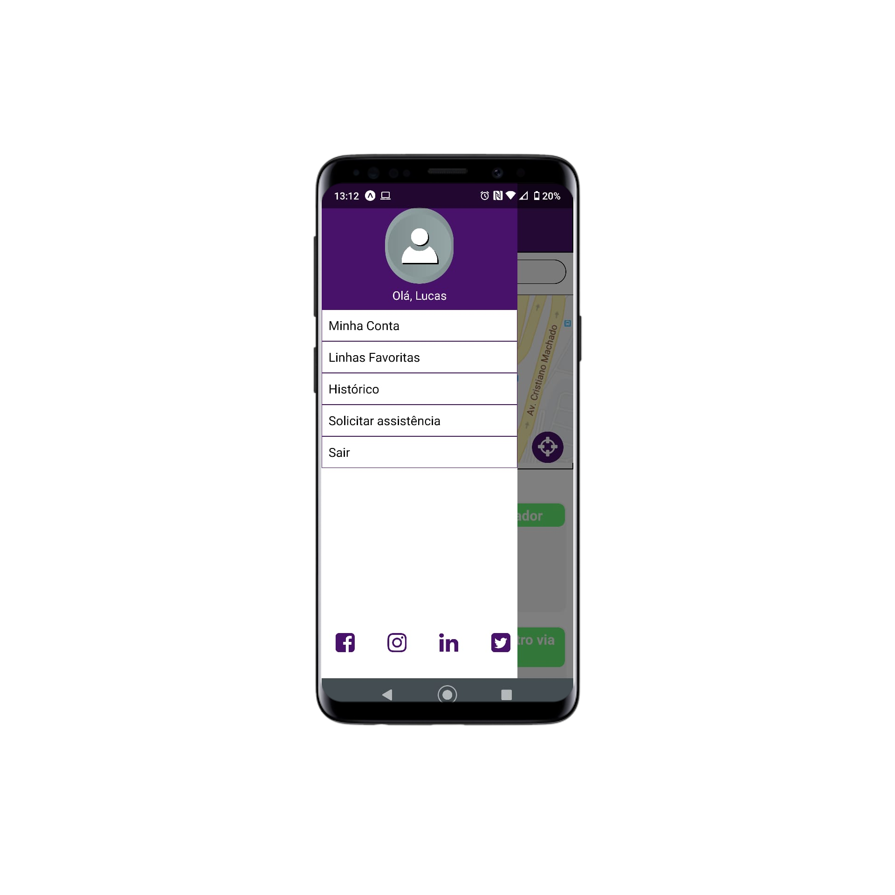
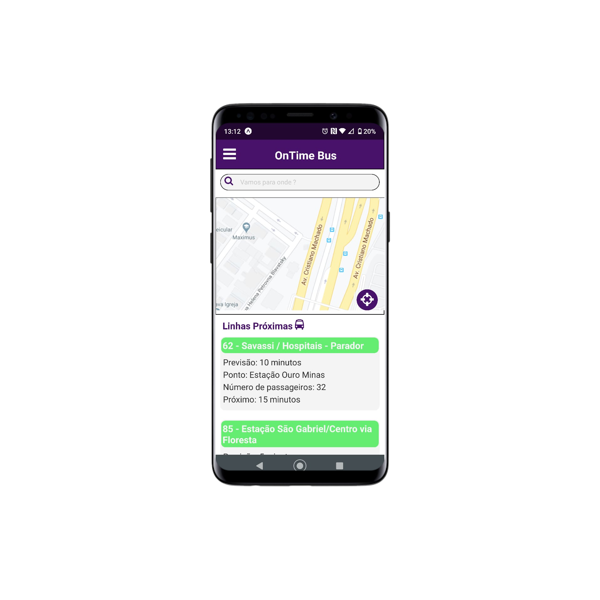

# 🚍 OnTimeBus - Projeto Interdisciplinar Uni-BH

## 📲 Layout 

## ✏ Sobre o projeto

O OnTimeBus é um projeto que estou desenvolvendo na faculdade com o objetivo de ser o protótipo do artigo que estou escrevendo.
Com base na sua localização e para onde você deseja ir o aplicativo irá traçar a melhor rota até o destino, além de informar a lotação do ônibus com o auxilio de visão computacional.

<b>Repositório Visão Computacional: <b/> <a>#EmBreve</a>

## ⌨ Tecnologias utilizadas 
 <b> <ul>
 <li> React Native </li>
 <li> React </li>
 <li> Expo </li>
 <li> NodeJs </li>
 <li> SQL Server </li>
 </ul> </b> 
